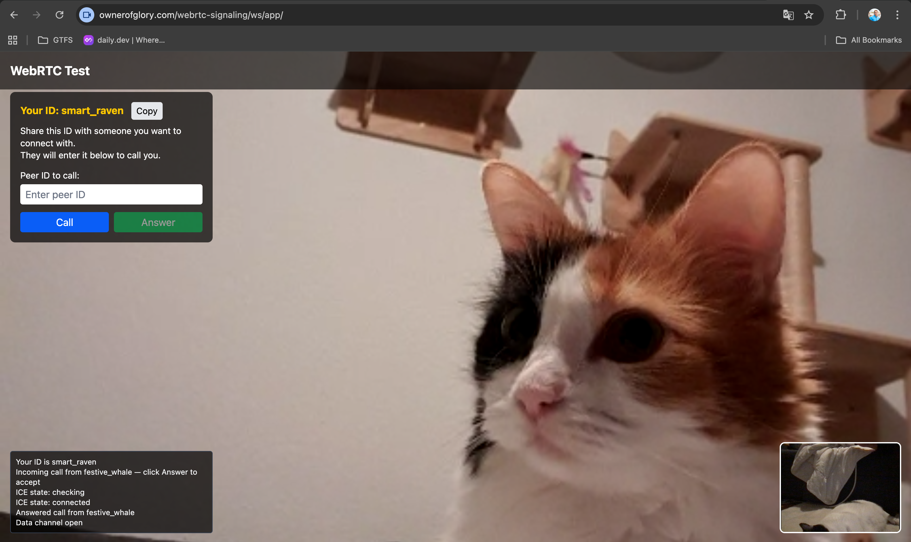

# WebRTC signaling Go

Small server app written in `Go` that acts as a signaling server for `WebRTC`.

## Demo
See a [demo app using WebRTC](https://ownerofglory.com/webrtc-signaling/ws/app/).

### Try it
Share your ID with someone you want to call you. When you receive a call hit 'Answer' button and allow using the camera and the microphone.

Or enter ID of someone to call and hit 'Call'. It may take from about 30sec to 1min to establish a call.
